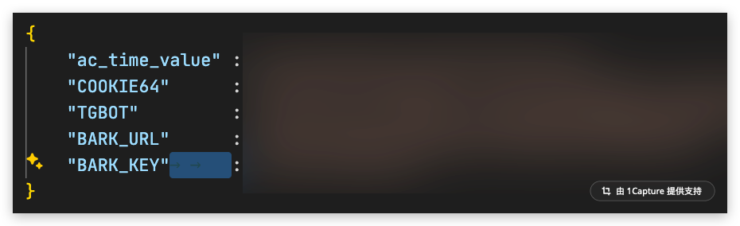

# deleteFans
Bilibili移除自己的粉丝


本项目主要是觉得你粉丝数量太多,或者被恶意刷粉,进行的移除粉丝操作

经测试 一天只能移除500个粉丝 超过500个会提示 {'code': -509, 'message': '请求过于频繁，请稍后再试', 'ttl': 1}


```
 pip3 install -r requirements.txt --target=./pylib
```

~~在github secret 中设置 COOKIE64=Base64(bilibil cookie)~~



# 第一次，运行
0. 在浏览器隐私窗口中，登录，
   1. 复制cookie ,并base64encode 一下
   2. 运行 localStorage.getItem("ac_time_value")
1. 新建一个文件 `cfg.json`
   1.  如上图写入 ac_time_value COOKIE64
2. 运行 `phthon3 aes.py会生成 cfgA.json.enc 文件
   1. 将 cfgA.json.enc 文件内容覆盖  cfg.json.enc 内容

3. 运行 `python3 deleteFans.py`

> 在 githubci中设置 CFGKEY 的secret变量，细节不表


运行


# 删除 过去的评论

b站没有对应的功能，这里使用第三方的。
网页
https://www.aicu.cc/reply.html?uid=${uid} 
> 不是实时，半年更新一次 😂

接口 https://api.aicu.cc/api/v3/search/getreply?uid=${uid}$&pn=1&ps=100&mode=0&keyword=


> 通过历史记录轮询，查询评论，可能会有遗


#TODO
- [x] 刷新cookie，果然事情没这么简单。  
- [x] 改为sqlite ? 


[接口这里](https://github.com/SocialSisterYi/bilibili-API-collect/blob/master/docs/login/cookie_refresh.md)

[这里](https://github.com/SocialSisterYi/bilibili-API-collect/issues/524)


